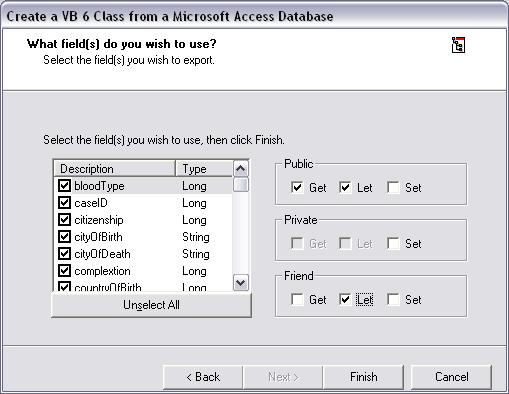



## Create a VB 6 class from an Access database

### Description

This code takes an Access 2000 database and creates a VB 6 class. Greatly reduces the amount of time you spend creating classes based off of your databases!
 
### More Info
 

             |
---                |---
**Submitted On**   |2002-01-08 16:01:20
**By**             |[Jason R\. Fayling](https://github.com/Planet-Source-Code/PSCIndex/blob/master/ByAuthor/jason-r-fayling.md)
**Level**          |Beginner
**User Rating**    |4.7 (14 globes from 3 users)
**Compatibility**  |VB 6\.0
**Category**       |[Databases/ Data Access/ DAO/ ADO](https://github.com/Planet-Source-Code/PSCIndex/blob/master/ByCategory/databases-data-access-dao-ado__1-6.md)
**World**          |[Visual Basic](https://github.com/Planet-Source-Code/PSCIndex/blob/master/ByWorld/visual-basic.md)
**Archive File**   |[Create\_a\_V47250182002\.zip](https://github.com/Planet-Source-Code/jason-r-fayling-create-a-vb-6-class-from-an-access-database__1-30573/archive/master.zip)

